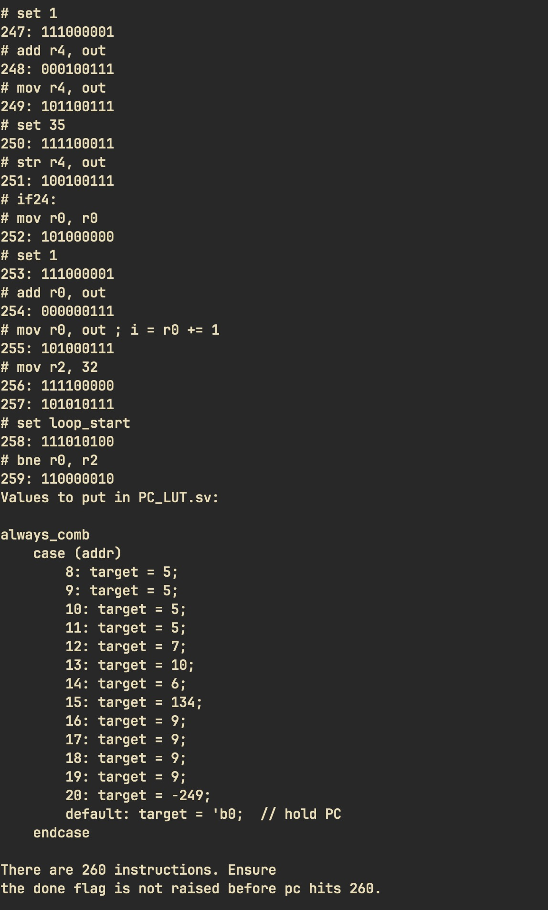

# 9 bit processor

## Guide to the repo


### asm.py

A user-friendly assembler that features pseudo ops, debug output, and comment parsing.

### prog[n]\_mach\_code.txt

Contains machine code that can be run if copied to src/mach\_code.txt immediately.
The branch immediate values have been adjusted so that the current PC LUT
can run all 3 of them without being modified.

### /src

Contains all of the SystemVerilog files that make up the microprocessor.

#### mach\_code.txt

Contains the machine code that will be read by the instruction ROM by default.
The contents of this file determine which program you are runnning.


### /pseudocode

Contains C-like pseudocode for each of the test programs

### /test\_asm

Contains assembly programs used to test the microprocessor
or the assembler.
    


## Using the assembler

Make sure you have python3 installed. Write a script in LEAP asm, and save
it as prog.s. To get the debug output, run

```
python asm.py prog.s
```



To output the clean machine code to a file called `mach_code.txt` run

```
python asm.py prog.s mach_code.txt
```

The output should show what values to put in `PC_LUT.sv`.

## Running the given test programs

If you just want preassembled code to run, use the `prog[n]_mach_code.txt` files, which
are compiled versions of the assembly code in `program[n].s`. The values in `PC_LUT.sv`
have been updated so that all 3 of these can be run without changing it's contents.


For example, if you want to run `program1.s`, do the following:

1. Copy `prog1_mach_code.txt` to `src/mach_code.txt`
2. Verify that the path in `instr_ROM` points to `src/mach_code.txt` on your machine
3. Set `prog1_tb.sv` to be the testbench in quartus
4. Simulate the testbench in Modelsim
